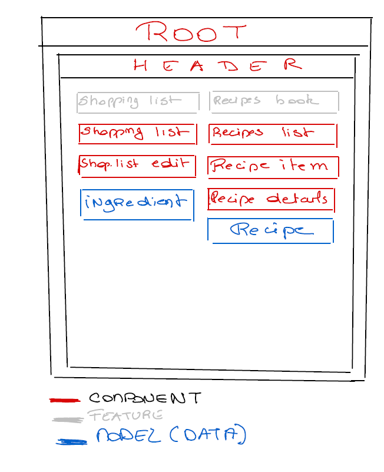

# Angular - Course Project
## The Basics

This project is an assignent from the [Angular bootcamp of Maximilian Schwarzmüller](https://www.udemy.com/course/the-complete-guide-to-angular-2)

### Project summary

Objective :
* having a shopping list managing single ingredients needed to buy;
* having a recipe book section managinf whole recipes.

### Plan of the app

